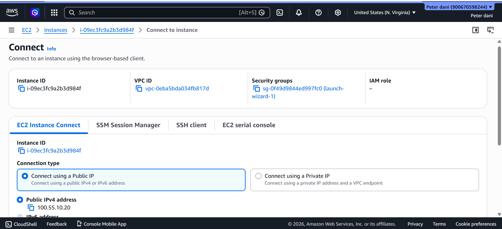
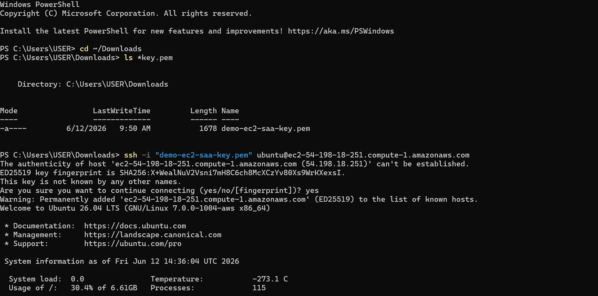

# AWS EC2 Linux SSH

## Project Overview

This project demonstrates how I launched an Ubuntu EC2 instance on Amazon Web Services (AWS) and securely connected to it using SSH from Windows PowerShell.

## AWS Services Used

- Amazon EC2
- Security Groups
- Key Pairs

## Skills Demonstrated

- Launching an Ubuntu EC2 instance
- Connecting securely using SSH
- Using Windows PowerShell
- Managing AWS key pairs
- Configuring Security Groups

## Project Steps

1. Created an Ubuntu EC2 instance.
2. Generated and downloaded an AWS Key Pair (.pem).
3. Configured the Security Group to allow SSH (Port 22).
4. Connected to the EC2 instance from Windows PowerShell using SSH.
5. Successfully logged into the Ubuntu server.

## Screenshots

### EC2 Instance Connect

### Successful SSH Login

## What I Learned

- How AWS EC2 works.
- How SSH provides secure remote access.
- The importance of Key Pairs and Security Groups.
- Basic Linux server access through AWS.

## Next Steps

- Install Nginx.
- Host a static website.
- Learn Elastic IP.
- Explore EC2 monitoring with CloudWatch.
